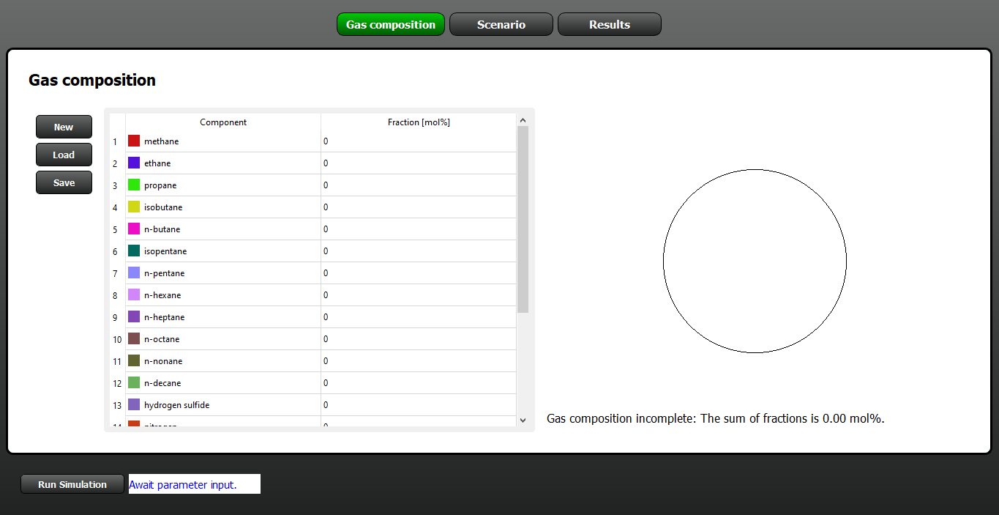
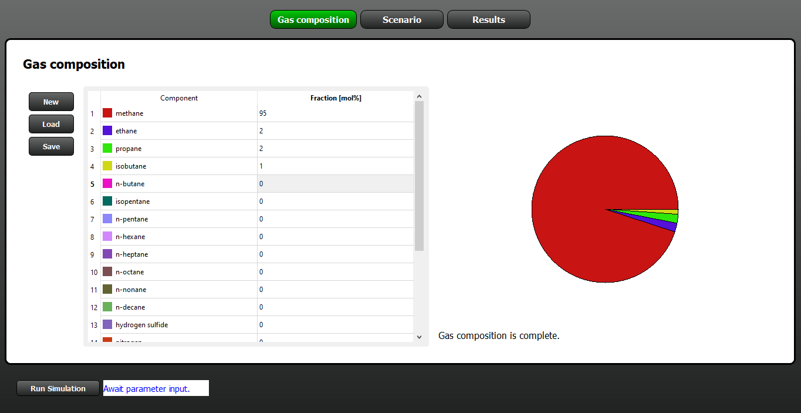
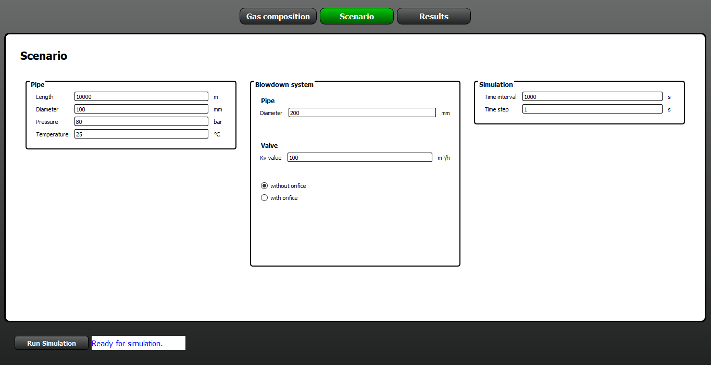
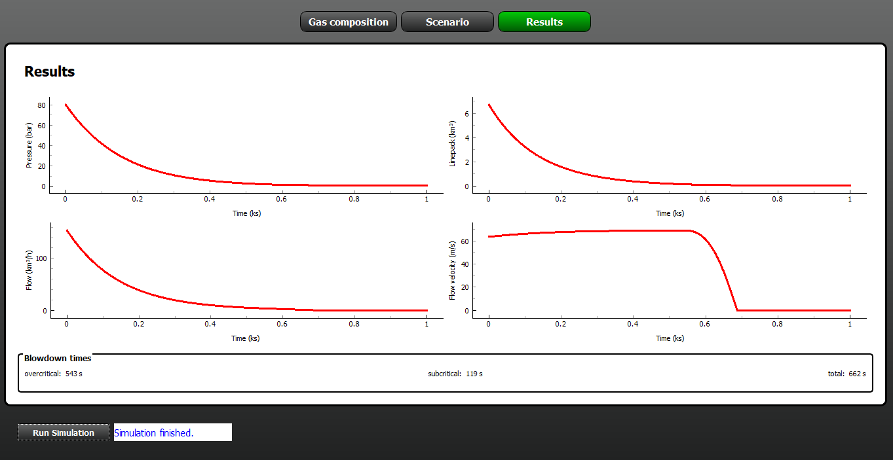

Tutorial
========

GasBlowdownCalculator is a package for the calculation of blowdown processes from 
high pressure gas pipelines.

GasBlowdownCalculator can be started from Anaconda prompt by

.. code:: bash

    gasblowdowncalculator

or from Python prompt by

.. code:: python

    >>> import gasblowdowncalculator
    >>> gasblowdowncalculator.gasblowdowncalculator.run()

When starting GasBlowdownCalculator, the gas composition submenu is displayed as shown in 
Figure 1.

    Figure 1: Gas composition submenu of GasBlowdownCalculator at program start.

The graphical user interface of the software consists of the following submenus:

* **Gas composition**: Enter a gas composition via their percentage fractions. The gas compostion can be loaded from or saved to a file as well.
* **Scenario**: Enter data for the pipeline under focus, the blowdown system (pipe, valve, and optionally an orifice), and simulation time.
* **Results**: Results of the simulation, i.e. plots of the time dependent curves for pressure, linepack, flow rate, and flow velocity, as well as blowdown times (criticial, subcriticial, total).

The user can switch between the submenus via the navigation bar on top. The simulation can
be performed after complete data input via the **Run simulation** button.

Gas composition
---------------

In this submenu, the user has the following options:

* **New**: Clear gas composition.
* **Load**: Load an existing gas composition from file.
* **Save**: Save the current gas composition to a file.

The pie chart and the status message give feedback about the completeness of the gas
composition.

After entering an exemplary gas composition the submenu appears as shown in 
Figure 2.

    Figure 2: Gas composition submenu after entering an exemplary gas composition.

Scenario
--------

In this submenu, the user has to enter the following data:

* Pipeline: length, diameter, initial pressure and temperature.
* Blowdown system: Pipe (diameter), valve (Kv value), and optionally orifice (diameter).
* Simulation: Time interval and time step.

After entering exemplary data the submenu appears as shown in 
Figure 3.

    Figure 3: Scenario submenu after entering exemplary data.

Simulation
----------

The simulation can be started via the button **Run simulation** if the data 
input is complete - the status message reads "Ready for simulation".

Results
-------

In this submenu, the results of the blowdown simulation are displayed, i.e. plots of 
the time dependent curves for pressure, linepack, flow rate, and flow velocity, 
as well as blowdown times (criticial, subcriticial, total).

After simulation the submenu appears as shown in Figure 4.

    Figure 4: Results submenu after simulation.
